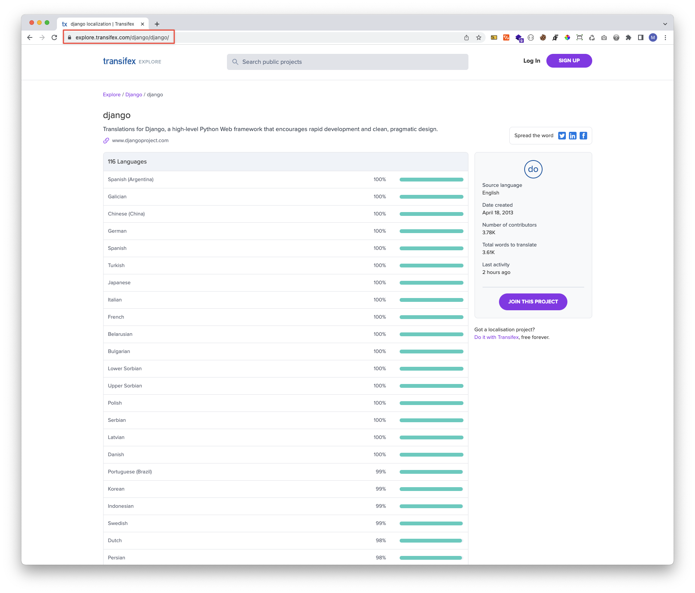
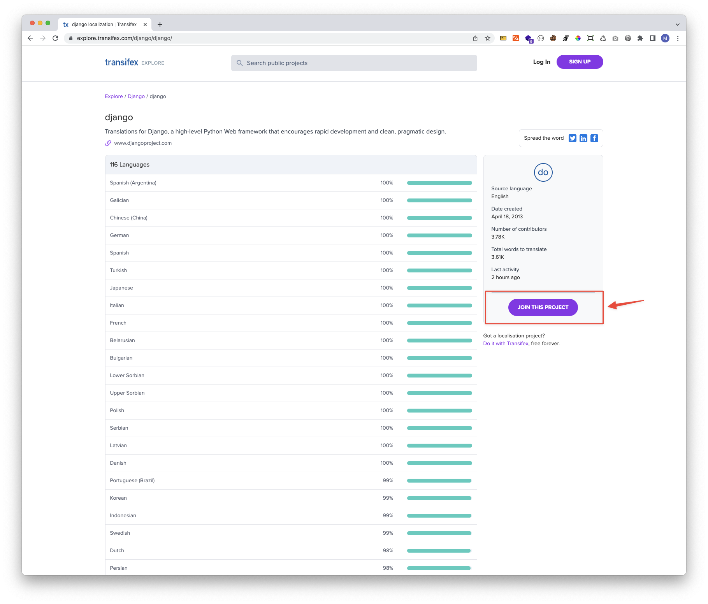
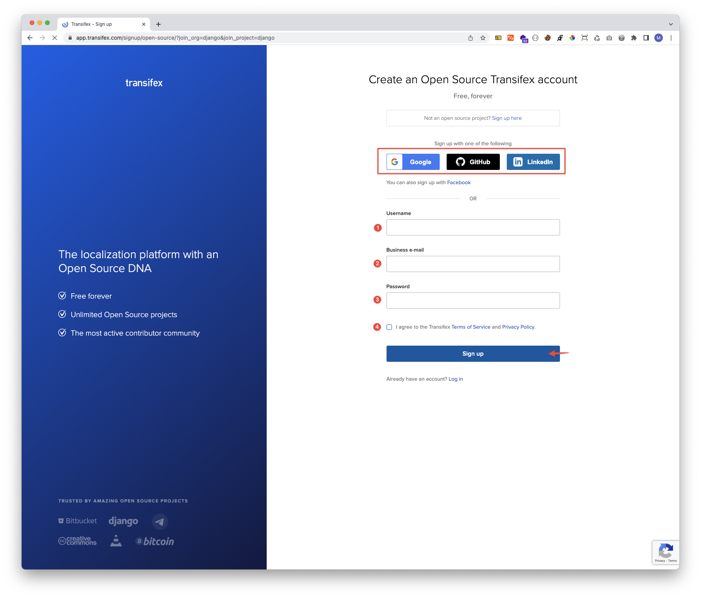

# Dj-Uyghurche Dj-ئۇيغۇرچە
Django ni uyghurchige yerleshtürüsh ( terjime qilish ) türi

Töwendiki qedemler arqiliq bu pirojege küch chiqiralaysiz ( héchqandaq yumshaq ditalni chüshürüsh kérek emes, hemma ishlarni torbet yüzide biwaste qilishqa bolidu)

1. [Bu ulanmini](https://explore.transifex.com/django/django/) bésib, orgen terep terjime ishlirini bashqurush üchün ishlitidighan tor bet supisigha kiring.

2. Bu pirojege qoshulush  digen konupkini bésing. 

3. ( Eger bar bolsa) gitxab, gugil we yaki linkin in hésabingizning birsi bilen terjime supisining hésabini éching, we yaki qollanghuchi ismi ( 1) , élxet adirsi (2), parol (3) qatarlqlarni toldurup, mulazimet shertige qoshulup (4) , tizimlash konupkisini bésing. 

4. Hemme ishlar utuqluq bolsa, bashqurghuchilargha élxet kétidighan bolup, sizni nahayiti téz waqit ichide terjime türige qoshup qoyimiz. 

Qollighiningiz üchün köptin köp rehmet.

----

1. <a href="https://explore.transifex.com/django/django/" target="_blank">بۇ ئۇلانمىنى</a> بېسىب، ئورگەن تەرەپ تەرجىمە ئىشلىرىنى باشقۇرۇش ئۈچۈن ئىشلىتىدىغان تور بەت سۇپىسىغا كىرىڭ.

2. بۇ پىروجەگە قوشۇلۇش  دىگەن كونۇپكىنى بېسىڭ. 

3. ( ئەگەر بار بولسا) گىتخاب، گۇگىل ۋە ياكى لىنكىن ئىن ھېسابىڭىزنىڭ بىرسى بىلەن تەرجىمە سۇپىسىنىڭ ھېسابىنى ئېچىڭ، ۋە ياكى قوللانغۇچى ئىسمى ( 1) ، ئېلخەت ئادىرسى (2)، پارول (3) قاتارلقلارنى تولدۇرۇپ، مۇلازىمەت شەرتىگە قوشۇلۇپ (4) ، تىزىملاش كونۇپكىسىنى بېسىڭ. 

4. ھەممە ئىشلار ئۇتۇقلۇق بولسا، باشقۇرغۇچىلارغا ئېلخەت كېتىدىغان بولۇپ، سىزنى ناھايىتى تېز ۋاقىت ئىچىدە تەرجىمە تۈرىگە قوشۇپ قويىمىز. 

قوللىغىنىڭىز ئۈچۈن كۆپتىن كۆپ رەھمەت.

